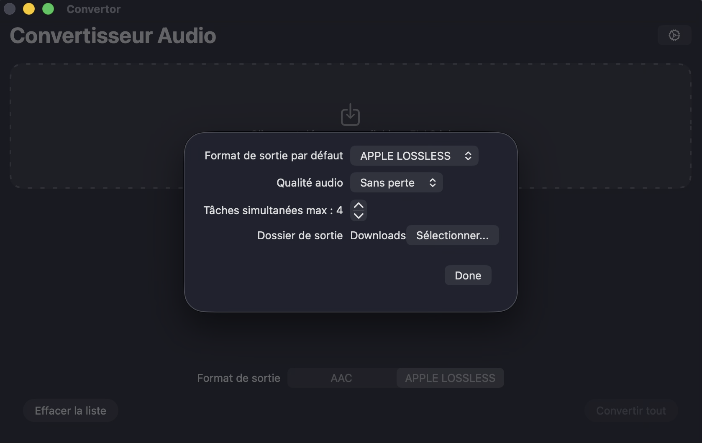

# Convertor

Audio file converter for macOS.

This application allows you to convert your FLAC files to AAC or Apple Lossless (ALAC) format. It's a simple and efficient tool for preparing your audio files for your Apple devices.

## Features

- Convert FLAC files to AAC or Apple Lossless.
- Drag and drop files or select them through a file dialog.
- Concurrent conversions to speed up the process.
- Progress indicators for each conversion.
- Cancellation of individual or all conversions.
- Notifications on conversion completion.
- Settings to customize the output format, audio quality, and more.
- Preserves metadata (including album art).
- English and French localization.

## Requirements

- macOS
- Xcode

## How to Build

1.  Clone the repository.
2.  Open `Convertor.xcodeproj` in Xcode.
3.  Select the `Convertor` scheme.
4.  Build and run the application.

## Screenshots

## License

---

# Convertor (Français)

Convertisseur de fichiers audio pour macOS.

Cette application vous permet de convertir vos fichiers FLAC au format AAC ou Apple Lossless (ALAC). C'est un outil simple et efficace pour préparer vos fichiers audio pour vos appareils Apple.

## Fonctionnalités

- Conversion des fichiers FLAC en AAC ou Apple Lossless.
- Glisser-déposer les fichiers ou les sélectionner via une boîte de dialogue.
- Conversions simultanées pour accélérer le processus.
- Indicateurs de progression pour chaque conversion.
- Annulation des conversions individuelles ou de toutes les conversions.
- Notifications à la fin des conversions.
- Paramètres pour personnaliser le format de sortie, la qualité audio, etc.
- Préserve les métadonnées (y compris les pochettes d'album).
- Localisation en anglais et en français.

## Prérequis

- macOS
- Xcode

## Comment compiler

1.  Clonez le dépôt.
2.  Ouvrez `Convertor.xcodeproj` dans Xcode.
3.  Sélectionnez le schéma `Convertor`.
4.  Compilez et exécutez l'application.

## Captures d'écran

## Licence
